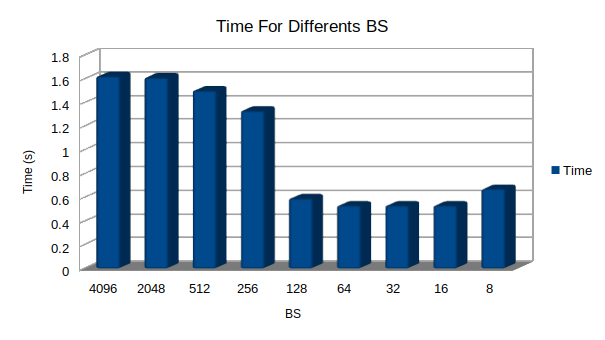
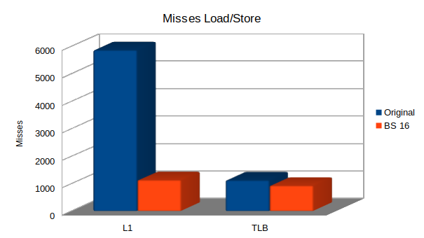
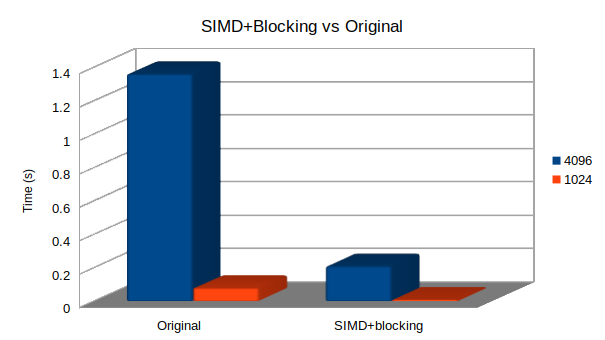
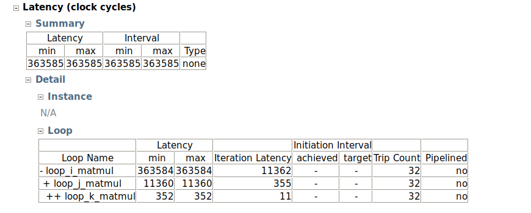
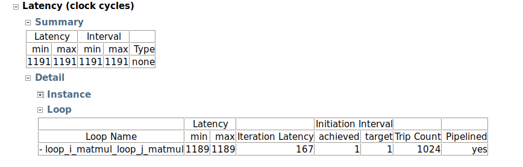

# LAB 6 SIMD And Acceleration

## 2. Transpose

### Transposition.c (old, float)

#### Original (adding instrumentation time)

El código completo esta aquí:  [transposition.c](./Entrega/2. Transpose/transposition.c) 

Le añadimos unas cuantas lineas para obtener información del tiempo de ejecución de la función transpose con la ayuda del time:   

```javascript
  // Data instrumentation timing
   struct tms start, end;
  ...
  // Insert instrumentation timing HERE (start timing)
    if (times(&start) == (clock_t)-1) exit(0);
    transpose(dst, src, dim);
    // Insert instrumentation timing HERE (end timing)
    if (times(&end) == (clock_t)-1) exit(0);
    // Check result
   float user =  (float)(end.tms_utime-start.tms_utime)/sysconf(_SC_CLK_TCK);
   float system = (float)(end.tms_stime-start.tms_stime)/sysconf(_SC_CLK_TCK);
   float elapsed = user + system;
  
    fprintf(stderr, "\n Timing: elapsed %f user %f segons, system: %f segons\n", elapsed, user, system);

```

La salida del time es esta [Original.txt](./Entrega/2. Transpose/Times/Original.txt)  y me ha dado de media 1.62 s

#### Blocking 

He utilizado este script  [timesTranspose.sh](./Entrega/2. Transpose/timesTranspose.sh) para calcular los tiempos por cada BS diferente y observar cual es el mejor:

```javascript
 #! /bin/bash

gcc -march=armv7-a -mfpu=neon -DBS=$1 transpositionOpti.c -O3  -o Opti$1

./Opti$1 4096 > time00
./Opti$1 4096 > time01
./Opti$1 4096 > time02
./Opti$1 4096 > time03
./Opti$1 4096 > time04

mkdir Times/$1
mv time0* Times/$1/1
```

Las salidas del time para los diferentes BS son estas:  [8.txt](./Entrega/2. Transpose/Times/8.txt)  [16.txt](./Entrega/2. Transpose/Times/16.txt)  [32.txt](./Entrega/2. Transpose/Times/32.txt)  [64.txt](./Entrega/2. Transpose/Times/64.txt)  [128.txt](./Entrega/2. Transpose/Times/128.txt)  [256.txt](./Entrega/2. Transpose/Times/256.txt)  [512.txt](./Entrega/2. Transpose/Times/512.txt)  [2048.txt](./Entrega/2. Transpose/Times/2048.txt)  [4096.txt](./Entrega/2. Transpose/Times/4096.txt) . Vemos que para los casos en que la BS es igual a 64, 32 o 16 se obtiene una media de 0,53 s que es lo más rápido que he observado. El speedUp respecto al original es del 3,0566



El código esta aquí: [Blocking.c](./Entrega/2. Transpose/Blocking.c) 

```javascript
void transpose(float *dst, float *src, int dim) {
    int i, j, ii, jj;
    for (i = 0; i < dim; i+=BS) 
        for(j = 0; j < dim; j+=BS) 
		for (ii = i; ii < i+BS; ii++) 
		        for(jj = j; jj < j+BS; jj++) 
           			dst[jj * dim + ii] = src[ii * dim + jj];        
    
}
```

##### Blocking: Perf

Observamos los load/stores en la TLB y L1 para el código original gracias al script  [caches.sh](./Entrega/2. Transpose/caches.sh) 

```javascript
#! /bin/bash

mkdir perf/$1

perf record --event cache-misses -F 500 ./$1 > /dev/null
perf report --stdio -n --header > perf/$1/cache_misses.txt

perf record --event L1-dcache-load-misses -F 500 ./$1 > /dev/null
perf report --stdio -n --header > perf/$1/L1D_load_misses.txt

perf record --event L1-dcache-store-misses -F 500 ./$1 > /dev/null
perf report --stdio -n --header > perf/$1/L1D_store_misses.txt

perf record --event dTLB-load-misses -F 500 ./$1 > /dev/null
perf report --stdio -n --header > perf/$1/TLBd_load_misses.txt

perf record --event dTLB-store-misses -F 500 ./$1 > /dev/null
perf report --stdio -n --header > perf/$1/TLBd_store_misses.txt
```


Ficheros completos aquí [cache_misses.txt](./Entrega/2. Transpose/perf/Original/cache_misses.txt)  [L1D_load_misses.txt](./Entrega/2. Transpose/perf/Original/L1D_load_misses.txt)  [L1D_store_misses.txt](./Entrega/2. Transpose/perf/Original/L1D_store_misses.txt)  [TLBd_load_misses.txt](./Entrega/2. Transpose/perf/Original/TLBd_load_misses.txt)  [TLBd_store_misses.txt](./Entrega/2. Transpose/perf/Original/TLBd_store_misses.txt) 

**TLB load y store (1126 misses):** 

```javascript
# Samples: 5  of event 'dTLB-load-misses'
# Event count (approx.): 430
#
# Overhead       Samples  Command   Shared Object      Symbol             
# ........  ............  ........  .................  ...................
#
    96.51%             1  Original  [kernel.kallsyms]  [k] strlen
     3.49%             4  perf      [kernel.kallsyms]  [k] perf_event_exec
     
# Samples: 5  of event 'dTLB-store-misses'
# Event count (approx.): 596
#
# Overhead       Samples  Command   Shared Object      Symbol                
# ........  ............  ........  .................  ......................
#
    96.81%             1  Original  [kernel.kallsyms]  [k] strnlen_user
     2.68%             1  perf      [kernel.kallsyms]  [k] perf_event_aux_ctx
     0.50%             3  perf      [kernel.kallsyms]  [k] perf_event_exec
```

**L1 load y store (5864 misses)**

```javascript
# Samples: 6  of event 'L1-dcache-load-misses'
# Event count (approx.): 5268
#
# Overhead       Samples  Command   Shared Object      Symbol                          
# ........  ............  ........  .................  ................................
#
    97.51%             1  Original  libc-2.23.so       [.] _IO_file_overflow@@GLIBC_2.4
     2.33%             1  Original  [kernel.kallsyms]  [k] zone_watermark_ok
     0.15%             4  perf      [kernel.kallsyms]  [k] perf_event_exec
     
# Samples: 5  of event 'L1-dcache-store-misses'
# Event count (approx.): 596
#
# Overhead       Samples  Command   Shared Object      Symbol             
# ........  ............  ........  .................  ...................
#
    96.81%             1  Original  [kernel.kallsyms]  [k] copy_page
     2.68%             1  perf      [kernel.kallsyms]  [k] strrchr
     0.50%             3  perf      [kernel.kallsyms]  [k] perf_event_exec
```

Comparamos para BS=16 por ejemplo [cache_misses.txt](./Entrega/2. Transpose/perf/Opti16/cache_misses.txt)  [L1D_load_misses.txt](./Entrega/2. Transpose/perf/Opti16/L1D_load_misses.txt)  [L1D_store_misses.txt](./Entrega/2. Transpose/perf/Opti16/L1D_store_misses.txt)  [TLBd_load_misses.txt](./Entrega/2. Transpose/perf/Opti16/TLBd_load_misses.txt)  [TLBd_store_misses.txt](./Entrega/2. Transpose/perf/Opti16/TLBd_store_misses.txt) 

**TLB load y store ( 931 misses)**

```javascript
# Samples: 5  of event 'dTLB-load-misses'
# Event count (approx.): 443
#
# Overhead       Samples  Command  Shared Object      Symbol             
# ........  ............  .......  .................  ...................
#
    96.61%             1  Opti16   [kernel.kallsyms]  [k] vmacache_find
     3.39%             4  perf     [kernel.kallsyms]  [k] perf_event_exec
     
# Samples: 5  of event 'dTLB-store-misses'
# Event count (approx.): 488
#
# Overhead       Samples  Command  Shared Object      Symbol             
# ........  ............  .......  .................  ...................
#
    96.52%             1  Opti16   [kernel.kallsyms]  [k] strnlen_user
     2.87%             1  perf     [kernel.kallsyms]  [k] strrchr
     0.61%             3  perf     [kernel.kallsyms]  [k] perf_event_exec
```

**L1 load y store (1132 misses)**

```javascript
# Samples: 5  of event 'L1-dcache-load-misses'
# Event count (approx.): 552
#
# Overhead       Samples  Command  Shared Object      Symbol                
# ........  ............  .......  .................  ......................
#
    96.56%             1  Opti16   [kernel.kallsyms]  [k] atime_needs_update
     2.90%             1  Opti16   [kernel.kallsyms]  [k] mmiocpy
     0.54%             3  perf     [kernel.kallsyms]  [k] strrchr
     
# Samples: 5  of event 'L1-dcache-store-misses'
# Event count (approx.): 580
#
# Overhead       Samples  Command  Shared Object      Symbol             
# ........  ............  .......  .................  ...................
#
    96.72%             1  Opti16   [kernel.kallsyms]  [k] copy_page
     2.76%             1  perf     [kernel.kallsyms]  [k] mmioset
     0.52%             3  perf     [kernel.kallsyms]  [k] perf_event_exec
```

#### Blocking: Conclusión

Observando los misses en TLB, vemos que para BS 16 es un poco mejor, pero no hay mucha diferencia. Donde si que obtenemos una mejora considerable son en los accesos(load en especial5) a L1, donde hacemos casi 6 veces menos de misses. Por lo tanto, podemos afirmar que para BS 16 estamos aprovechando la localidad temporal asegurando una reducción de accessos y por lo tanto de fallos a L1 en este caso.



#### SIMD and Blocking (transposition.c new, with chars)

He hecho una rápida prueba con timing con BS=16,8,4 y he visto que para BS igual a 8 da el mejor timing, así que he decidido hacer SIMD con matrices de 8x8. Los times del optimizado están aquí  [time00.txt](./Entrega/2. Transpose/SIMD+blocking(char)/entrega/Times/SIMD/4096/time00.txt)  [time01.txt](./Entrega/2. Transpose/SIMD+blocking(char)/entrega/Times/SIMD/4096/time01.txt)  [time02.txt](./Entrega/2. Transpose/SIMD+blocking(char)/entrega/Times/SIMD/4096/time02.txt)  [time03.txt](./Entrega/2. Transpose/SIMD+blocking(char)/entrega/Times/SIMD/4096/time03.txt)  [time04.txt](./Entrega/2. Transpose/SIMD+blocking(char)/entrega/Times/SIMD/4096/time04.txt) .De media da 0.21 s. Respecto al original con chars el speedUp es de un 6,4762. (De media el original con chars da 1,36s  [4096.txt](./Entrega/2. Transpose/SIMD+blocking(char)/entrega/Times/Original/4096/4096.txt)  )

 Código con SIMD y blocking:  [SIMDChar.c](./Entrega/2. Transpose/SIMD+blocking(char)/entrega/SIMDChar.c) 

```javascript
void transpose(uint8_t *dst, const uint8_t *src, int dim) {
int i, j;
for(i = 0; i < dim; i+=BS){
	for(j = 0; j < dim; j+=BS ){ 
		//dst[j * dim + i] = src[i * dim + j];    
		/* LOADS 8x8 CHARS*/
		uint8x8_t s0 = vld1_u8(&src[j+i*dim]);
		uint8x8_t s1 = vld1_u8(&src[j+(i+1)*dim]);
		uint8x8_t s2 = vld1_u8(&src[j+(i+2)*dim]);
		uint8x8_t s3 = vld1_u8(&src[j+(i+3)*dim]);
		uint8x8_t s4 = vld1_u8(&src[j+(i+4)*dim]);
		uint8x8_t s5 = vld1_u8(&src[j+(i+5)*dim]);
		uint8x8_t s6 = vld1_u8(&src[j+(i+6)*dim]);
		uint8x8_t s7 = vld1_u8(&src[j+(i+7)*dim]);
		

		/*TRANSPOSE*/
		uint8x8x2_t t0 = vtrn_u8 (s0,s1);
                uint8x8x2_t t1 = vtrn_u8 (s2,s3);
                uint8x8x2_t t2 = vtrn_u8 (s4,s5);
                uint8x8x2_t t3 = vtrn_u8 (s6,s7);

		 uint16x4x2_t x0 = vtrn_u16 (vreinterpret_u16_u8(t0.val[0]),
					  vreinterpret_u16_u8(t1.val[0]));
                 uint16x4x2_t x1 = vtrn_u16 (vreinterpret_u16_u8(t2.val[0]),
                                          vreinterpret_u16_u8(t3.val[0]));
                 uint16x4x2_t x2 = vtrn_u16 (vreinterpret_u16_u8(t0.val[1]),
                                          vreinterpret_u16_u8(t1.val[1]));
                 uint16x4x2_t x3 = vtrn_u16 (vreinterpret_u16_u8(t2.val[1]),
                                          vreinterpret_u16_u8(t3.val[1]));


		 uint32x2x2_t f0 = vtrn_u32 (vreinterpret_u32_u16(x0.val[0]),
					  vreinterpret_u32_u16(x1.val[0]));
                 uint32x2x2_t f1 = vtrn_u32 (vreinterpret_u32_u16(x0.val[1]),
					  vreinterpret_u32_u16(x1.val[1]));
		 uint32x2x2_t f2 = vtrn_u32 (vreinterpret_u32_u16(x2.val[0]),
					  vreinterpret_u32_u16(x3.val[0]));
		 uint32x2x2_t f3 = vtrn_u32 (vreinterpret_u32_u16(x2.val[1]),
					  vreinterpret_u32_u16(x3.val[1]));

		/* STORES 8X8 CHARS */
		vst1_u8(&dst[i+j*dim],   vreinterpret_u8_u32(f0.val[0]));
		vst1_u8(&dst[i+(j+1)*dim], vreinterpret_u8_u32(f2.val[0]));
		vst1_u8(&dst[i+(j+2)*dim], vreinterpret_u8_u32(f1.val[0]));
		vst1_u8(&dst[i+(j+3)*dim], vreinterpret_u8_u32(f3.val[0]));
		vst1_u8(&dst[i+(j+4)*dim], vreinterpret_u8_u32(f0.val[1]));
		vst1_u8(&dst[i+(j+5)*dim], vreinterpret_u8_u32(f1.val[1]));
		vst1_u8(&dst[i+(j+6)*dim], vreinterpret_u8_u32(f2.val[1]));
		vst1_u8(&dst[i+(j+7)*dim], vreinterpret_u8_u32(f3.val[1]));			
               } 
	}
}
```

##### Perf SIMD+Blocking

Los archivos son: [cache_misses.txt](./Entrega/2. Transpose/SIMD+blocking(char)/entrega/perf/transposition.3/cache_misses.txt)  [L1D_load_misses.txt](./Entrega/2. Transpose/SIMD+blocking(char)/entrega/perf/transposition.3/L1D_load_misses.txt)  [L1D_store_misses.txt](./Entrega/2. Transpose/SIMD+blocking(char)/entrega/perf/transposition.3/L1D_store_misses.txt)  [TLBd_load_misses.txt](./Entrega/2. Transpose/SIMD+blocking(char)/entrega/perf/transposition.3/TLBd_load_misses.txt)  [TLBd_store_misses.txt](./Entrega/2. Transpose/SIMD+blocking(char)/entrega/perf/transposition.3/TLBd_store_misses.txt) 

 En la mayoría observamos muchos menos samples comparados con blocking, por ejemplo en la TLB:

**TLB Load/store**

```javascript
# Samples: 121  of event 'dTLB-load-misses'
# Event count (approx.): 2916366
#
# Overhead       Samples  Command          Shared Object      Symbol                         
# ........  ............  ...............  .................  ...............................
#
    92.43%           101  transposition.3  transposition.3    [.] transpose
     3.19%             5  transposition.3  [kernel.kallsyms]  [k] handle_mm_fault
     2.47%             6  transposition.3  [kernel.kallsyms]  [k] do_page_fault
     0.78%             2  transposition.3  [kernel.kallsyms]  [k] page_add_new_anon_rmap
     0.63%             1  transposition.3  [kernel.kallsyms]  [k] _raw_spin_unlock_irqrestore
     0.48%             1  transposition.3  [kernel.kallsyms]  [k] __memzero
     0.01%             1  transposition.3  [kernel.kallsyms]  [k] strnlen_user
     0.00%             4  perf             [kernel.kallsyms]  [k] perf_event_exec
     
# Samples: 123  of event 'dTLB-store-misses'
# Event count (approx.): 2880151
#
# Overhead       Samples  Command          Shared Object      Symbol                 
# ........  ............  ...............  .................  .......................
#
    93.66%           104  transposition.3  transposition.3    [.] transpose
     3.83%             8  transposition.3  [kernel.kallsyms]  [k] do_page_fault
     1.05%             3  transposition.3  [kernel.kallsyms]  [k] __memzero
     0.95%             2  transposition.3  [kernel.kallsyms]  [k] handle_mm_fault
     0.50%             1  transposition.3  [kernel.kallsyms]  [k] __lru_cache_add
     0.01%             1  transposition.3  [kernel.kallsyms]  [k] cap_bprm_secureexec
     0.00%             1  perf             [kernel.kallsyms]  [k] perf_event_comm
     0.00%             3  perf             [kernel.kallsyms]  [k] perf_event_exec
```


### 2.1 Performance Evaluation of Transposition

Original:  [4096.txt](./Entrega/2. Transpose/SIMD+blocking(char)/entrega/Times/Original/4096/4096.txt)  [1024.txt](./Entrega/2. Transpose/SIMD+blocking(char)/entrega/Times/Original/1024/1024.txt)  [256.txt](./Entrega/2. Transpose/SIMD+blocking(char)/entrega/Times/Original/256/256.txt)  [64.txt](./Entrega/2. Transpose/SIMD+blocking(char)/entrega/Times/Original/64/64.txt)  [16.txt](./Entrega/2. Transpose/SIMD+blocking(char)/entrega/Times/Original/16/16.txt) 

SIMD+blocking: [4096.txt](./Entrega/2. Transpose/SIMD+blocking(char)/entrega/Times/SIMD/4096/4096.txt)  [1024.txt](./Entrega/2. Transpose/SIMD+blocking(char)/entrega/Times/SIMD/1024/1024.txt)  [256.txt](./Entrega/2. Transpose/SIMD+blocking(char)/entrega/Times/SIMD/256/256.txt)  [64.txt](./Entrega/2. Transpose/SIMD+blocking(char)/entrega/Times/SIMD/64/64.txt)  [16.txt](./Entrega/2. Transpose/SIMD+blocking(char)/entrega/Times/SIMD/16/16.txt) 

La gráfica lo he hecho con 4096 y 1024 porque los demás me dan 0s. Donde se ve una gran mejora es para una matriz de 4096x4096. En cambio, para 1024x1024 hay bastante mejora, pero en términos cuantificativos, simplemente mejora 0,07s



## 3. MxM acceleration

### 3.1 Add target device pragma - fpga task

La directiva que indica que vamos a accelerar la función **matmulBlock_hw** en la fpga copiando todas las dependecias e indicando que se generará un único accelerador hardware es: 

```javascript
#pragma omp target device(fpga, smp) copy_deps num_instances(1)
```

Con fpga indicamos que la tarea se accelerará en nuestra fpga en tiempo de compilación. Con smp específicamos que, en tiempo de ejecución, se usará un núcleo de la ARM.

La función completa queda así:

```javascript
#pragma omp target device(fpga, smp) copy_deps num_instances(1)
#pragma omp task in	  ([CONST_BSIZE*CONST_BSIZE]a,  \
				[CONST_BSIZE*CONST_BSIZE]b)  \
                		inout([CONST_BSIZE*CONST_BSIZE]c)
void matmulBlock_hw(elem_t *a, elem_t *b, elem_t *c) {
   unsigned int i, j, k;
loop_i_matmul:
   for (i = 0; i < BSIZE; i++) {
loop_j_matmul:  
      for (j = 0; j < BSIZE; j++) {
         elem_t sum = c[i*BSIZE + j];
loop_k_matmul:
         for (k = 0; k < BSIZE; k++) {
            sum += a[i*BSIZE + k] * b[k*BSIZE + j];
         }
         c[i*BSIZE + j] = sum;
      }
   }
}
```


### 3.2 HLS Analysis of the Naive Version - 32x32

Tras haber sido trolleado y ver que la directiva ya estaba en el código, he rectificado y quitado el "smp" del "pragma omp target ....".

Las latencias de cada bucle de **matmulBlock_hw_moved** y su intervalo son las siguientes:

 [matmulBlock_hw_moved_csynth.rpt](./Entrega/3. MxM Acceleration/native/matmulBlock_hw_moved_csynth.rpt) 



- Las latencias son los ciclos que tarda el dato en question desde su solicitud a memoria y la disponibilidad de este en la UP (Unidad de Procesado).

- El intervalo debe ser la manera en que se particiona los datos  solicitados. En nuestro caso pone type none porque no tenemos definido ningún tipo de particionado


### 3.3 First Vivado HLS Optimization - 32x32

Añadimos pipeline y decidimos que tipo de particionado haremos con las variables a y b, en mi caso he hecho lo siguiente:

```javascript
#pragma omp target device(fpga) copy_deps num_instances(1)
#pragma omp task in([CONST_BSIZE*CONST_BSIZE]a, [CONST_BSIZE*CONST_BSIZE]b) inout([CONST_BSIZE*CONST_BSIZE]c)
void matmulBlock_hw(elem_t *a, elem_t *b, elem_t *c) {
#pragma HLS array_partition variable=a cyclic factor=16 dim=1
#pragma HLS array_partition variable=b block factor=32 dim=1
   unsigned int i, j, k;
loop_i_matmul:
   for (i = 0; i < BSIZE; i++) {
loop_j_matmul:  
      for (j = 0; j < BSIZE; j++) {
#pragma HLS PIPELINE II=1
         elem_t sum = c[i*BSIZE + j];
loop_k_matmul:
         for (k = 0; k < BSIZE; k++) {
            sum += a[i*BSIZE + k] * b[k*BSIZE + j];
         }
         c[i*BSIZE + j] = sum;
      }
   }
}
```

El resultado de Vivaldo respecto a las latencias es el siguiente:

 [matmulBlock_hw_moved_csynth.rpt](./Entrega/3. MxM Acceleration/pipeline/matmulBlock_hw_moved_csynth.rpt) 



Como observamos, hemos conseguido reducir las latencias una barbaridad. Respecto a los ciclos del anterior resultado (3.2), hemos obtenido un speedup de 305.277 (363585/1191)

### 3.4 MxM application - Task Granularity - Increasing Data Level Parallelism

Despues de cambiar la macro de BSIZE a 64 hemos modificado lo siguiente en la función **matmulBlock_hw_moved**

```javascript
....
#pragma HLS array_partition variable=a cyclic factor=32 dim=1
#pragma HLS array_partition variable=b block factor=64 dim=1
....
#pragma HLS PIPELINE II=2
```

Hemos aumentado el doble el número de chunks puesto que el bloque de datos ahora es el doble, si queremos tener el mismo tamaño de cada chunk, debemos doblar el número. Sino, haríamos particiones más grandes, y no es la idea.


### 3.5 Performance Evaluation of Matrix Multiply

#### Secuencial 32x32

```javascript
=================== CHECKING ===================== 
Test passed.
================================================== 
==================== RESULTS ===================== 
  Benchmark: Matmul (OmpSs)
  Elements type: float
  Execution time (secs): 56.612335
================================================== 
=================== CHECKING ===================== 
Test passed.
================================================== 
==================== RESULTS ===================== 
  Benchmark: Matmul (OmpSs)
  Elements type: float
  Execution time (secs): 56.753091
================================================== 
=================== CHECKING ===================== 
Test passed.
================================================== 
==================== RESULTS ===================== 
  Benchmark: Matmul (OmpSs)
  Elements type: float
  Execution time (secs): 57.750021
================================================== 
=================== CHECKING ===================== 
Test passed.
================================================== 
==================== RESULTS ===================== 
  Benchmark: Matmul (OmpSs)
  Elements type: float
  Execution time (secs): 56.456078
================================================== 
=================== CHECKING ===================== 
Test passed.
================================================== 
==================== RESULTS ===================== 
  Benchmark: Matmul (OmpSs)
  Elements type: float
  Execution time (secs): 57.610755
==================================================
```

#### Secuencial 64x64

````javascript
=================== CHECKING ===================== 
Test passed.
================================================== 
==================== RESULTS ===================== 
  Benchmark: Matmul (OmpSs)
  Elements type: float
  Execution time (secs): 55.786302
================================================== 
=================== CHECKING ===================== 
Test passed.
================================================== 
==================== RESULTS ===================== 
  Benchmark: Matmul (OmpSs)
  Elements type: float
  Execution time (secs): 55.744052
================================================== 
=================== CHECKING ===================== 
Test passed.
================================================== 
==================== RESULTS ===================== 
  Benchmark: Matmul (OmpSs)
  Elements type: float
  Execution time (secs): 55.546104
================================================== 
=================== CHECKING ===================== 
Test passed.
================================================== 
==================== RESULTS ===================== 
  Benchmark: Matmul (OmpSs)
  Elements type: float
  Execution time (secs): 55.410591
================================================== 
=================== CHECKING ===================== 
Test passed.
================================================== 
==================== RESULTS ===================== 
  Benchmark: Matmul (OmpSs)
  Elements type: float
  Execution time (secs): 55.559078
==================================================
````

#### FPGA Pipeline and Partition 32x32

Ejecutables:  [matmul.bin](./Entrega/3. MxM Acceleration/pipeline/32/matmul.bin)  [matmul-i](./Entrega/3. MxM Acceleration/pipeline/32/matmul-i) 

```javascript
=================== CHECKING ===================== 
Test passed.
================================================== 
==================== RESULTS ===================== 
  Benchmark: Matmul (OmpSs)
  Elements type: float
  Execution time (secs): 9.757690
================================================== 
=================== CHECKING ===================== 
Test passed.
================================================== 
==================== RESULTS ===================== 
  Benchmark: Matmul (OmpSs)
  Elements type: float
  Execution time (secs): 9.712541
================================================== 
=================== CHECKING ===================== 
Test passed.
================================================== 
==================== RESULTS ===================== 
  Benchmark: Matmul (OmpSs)
  Elements type: float
  Execution time (secs): 9.674623
================================================== 
=================== CHECKING ===================== 
Test passed.
================================================== 
==================== RESULTS ===================== 
  Benchmark: Matmul (OmpSs)
  Elements type: float
  Execution time (secs): 9.791064
================================================== 
=================== CHECKING ===================== 
Test passed.
================================================== 
==================== RESULTS ===================== 
  Benchmark: Matmul (OmpSs)
  Elements type: float
  Execution time (secs): 9.745381
================================================== 
```

#### FPGA Pipeline and Partition 64x64

Ejecutables:  [matmul.bin](./Entrega/3. MxM Acceleration/pipeline/64/matmul.bin)  [matmul-i](./Entrega/3. MxM Acceleration/pipeline/64/matmul-i) 

```javascript
=================== CHECKING ===================== 
Test passed.
================================================== 
==================== RESULTS ===================== 
  Benchmark: Matmul (OmpSs)
  Elements type: float
  Execution time (secs): 1.278164
================================================== 
=================== CHECKING ===================== 
Test passed.
================================================== 
==================== RESULTS ===================== 
  Benchmark: Matmul (OmpSs)
  Elements type: float
  Execution time (secs): 1.259999
================================================== 
=================== CHECKING ===================== 
Test passed.
================================================== 
==================== RESULTS ===================== 
  Benchmark: Matmul (OmpSs)
  Elements type: float
  Execution time (secs): 1.256768
================================================== 
=================== CHECKING ===================== 
Test passed.
================================================== 
==================== RESULTS ===================== 
  Benchmark: Matmul (OmpSs)
  Elements type: float
  Execution time (secs): 1.258148
================================================== 
=================== CHECKING ===================== 
Test passed.
================================================== 
==================== RESULTS ===================== 
  Benchmark: Matmul (OmpSs)
  Elements type: float
  Execution time (secs): 1.258195
==================================================
```

#### Average, Min, Max and SpeedUp

**Secuencial** para matriz 1024x1024

| BS   | Average   | Min       | Max       |
| ---- | --------- | --------- | --------- |
| 32   | 56.992060 | 56.456078 | 57.750021 |
| 64   | 55.616411 | 55.410591 | 55.786302 |

**FPGA** para matriz 1024x1024

| BS   | Average  | Min      | Max      |
| ---- | -------- | -------- | -------- |
| 32   | 9.738537 | 9.674623 | 9.791064 |
| 64   | 1.258780 | 1.256768 | 1.278164 |


| BS   | SpeedUp   |
| ---- | --------- |
| 32   | 5.852220  |
| 64   | 44.217213 |

